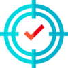

% Tips para mejorar la gestión de tu tiempo
% Adolfo Sanz De Diego (@asanzdiego)
% {style=box-shadow:none;}

## {style=box-shadow:none;}   Adolfo Sanz De Diego

> - Blog: [asanzdiego.com](http://asanzdiego.com/)
> - GitHub: [github.com/asanzdiego](http://github.com/asanzdiego)
> - Twitter: [twitter.com/asanzdiego](http://twitter.com/asanzdiego)
> - LinkedIn: [in/asanzdiego](http://www.linkedin.com/in/asanzdiego)
> - SlideShare: [slideshare.net/asanzdiego](http://www.slideshare.net/asanzdiego/)

## {style=box-shadow:none;}   Mi vida profesional

> - Asesor Técnico en la Consejería de Educación de la [CAM](http://www.comunidad.madrid/).
> - Colaboro como profesor en la [Universidad de Alcalá](http://www.uah.es/) en varios masters.
> - Colaboro como formador en [Pronoide](http://www.pronoide.com/) en varios cursos.
> - Lidero [HackathonLovers](http://www.pronoide.com/) montando hackathones.
> - Soy ponente en varios eventos y meetups.

## {style=box-shadow:none;}   Mi vida personal

> - Veo series, películas y charlas técnicas.
> - Aprendo algo nuevo todos los años.
> - Escribo más o menos un post al mes en mi blog.
> - Salgo a correr y voy al gimnasio.
> - Estoy casado y soy padre de 2 hijas.

## {style=box-shadow:none;}   Esta charla

> - Muchos amigos y compañeros me preguntan de dónde saco tiempo.
>       - {style=box-shadow:none;vertical-align:middle} De ahí la **motivación** de esta charla.
> - Es la primera charla no técnica que doy.
>       - {style=box-shadow:none;vertical-align:middle} De ahí la **preparación** de esta charla.

## {style=box-shadow:none;}   Vídeos resumen

> - [Getting Things Done (GTD) | David Allen](https://www.youtube.com/watch?v=gCswMsONkwY)
>       - Captura, clarifica, organiza, revisa, comprométete.
> - [The 7 habits of highly effective people | Stephen Covey](https://www.youtube.com/watch?v=ktlTxC4QG8g)
>       - Los 2 más importantes: sé proactivo y haz primero lo primero.
> - [80/20 Rule - Do More by Doing Less | The Pareto Principle](https://www.youtube.com/watch?v=EAynHZE-lK4)
>       - El 80% de las consecuencias proviene del 20% de las causas.

## {style=box-shadow:none;}   Charlas TED

> - [How to gain control of your free time | Laura Vanderkam](https://www.youtube.com/watch?v=n3kNlFMXslo)
>       - "No tengo tiempo", a menudo significa "No es una prioridad."
> - [How to stop screwing yourself over | Mel Robbins](https://www.youtube.com/watch?v=Lp7E973zozc)
>       - La regla de los 5 segundos para no procrastinar.
> - [What makes a good life? Lessons from the longest study on happiness | Robert Waldinger](https://www.youtube.com/watch?v=8KkKuTCFvzI)
>       - Las relaciones cercanas y verdaderas hacen más feliz a la persona que el dinero o la fama.

## {style=box-shadow:none;}   Objetivos

> - Los objetivos nos ayudan a cumplir nuestros **sueños**.
> - Tienen que ser **desafiantes** para que sean motivadores.
> - Tienen que ser **realizables** según nuestro nivel de habilidad.
> - Se tienen que **poder medir** para poder evaluar su consecución.
> - Sólo pueden **depender de ti** y no de terceras personas.
> - Cubre **todas las áreas importantes** de tu vida.
> - Evalúalos y escribe unos nuevos **al menos una vez al año**.

## {style=box-shadow:none;}   Áreas importantes

> - {style=box-shadow:none;vertical-align:middle;} **Salud**
>       - Alimentación, deporte, dormir, diversión...
> - {style=box-shadow:none;vertical-align:middle;} **Dinero**
>       - Trabajo, formación, gastos, ahorros...
> - {style=box-shadow:none;vertical-align:middle;} **Amor**
>       - Pareja, familia, amigos, comunidad...

## {style=box-shadow:none;}   Ejemplos de objetivos

> - Perder 2 kilos.
> - Correr una determinada carrera de X km.
> - Dormir 8 horas.
> - Superar el B2 de inglés.
> - Aprender una determinada tecnología.
> - Ahorrar X € al año.
> - Pasar más tiempo con mi familia.

## {style=box-shadow:none;}   Tareas

> - Las tareas nos ayudan a cumplir nuestros **objetivos**.
> - Tienen que ser **cortas** aunque haya muchas para un mismo objetivo.
> - Tienen que ser **concretas** para no dudar en su ejecución.
> - Se tienen que **poder agendar** para que no se diluyan en el día a día.
> - Cubre **todos los objetivos** de tus sueños.
> - Prioriza y agenda tus tareas **al menos una vez a la semana**.

## {style=box-shadow:none;}   Importante vs Urgente

+---------------+------------+---------------+
|               |  URGENTE   |  NO_URGENTE   |
+---------------+------------+---------------+
| IMPORTANTE    | - hazlo    | - agéndalo    |
+---------------+------------+---------------+
| NO_IMPORTANTE | - delégalo | - evítalo     |
+---------------+------------+---------------+

## {style=box-shadow:none;}   Ejemplos de tareas

> - Lunes y miércoles comer una ensalada.
> - Martes y jueves salir a correr de 20:00 a 21:00.
> - De lunes a viernes ponerme alarma a las 23:00 para irme a dormir.
> - Antes de acostarme 15 minutos de ejercicios de inglés.
> - En el metro ver charlas técnicas (si es posible en inglés).
> - A principio de mes meter X/12 € en la cuenta de ahorro de forma automática.
> - Domingos de 18:00 a 20:00 juegos de mesa en familia.

## {style=box-shadow:none;}   Herramientas

> - **Calendario** con agenda (para planificar tus tareas).
> - **Lista de tareas** (antes de agendarlas hay que priorizarlas).
>       - Ejemplo: <http://bit.ly/lista-tareas>
> - **Otras listas** (ej: de la compra o el blog, lo que no escribes se olvida).
> - **Alarmas** (móvil o reloj) programables.

## {style=box-shadow:none;}   Tips varios

> - Aprende a **decir NO** para no embarcarte en asuntos no planeados.
> - El tiempo de una tarea **se expande** en función del tiempo asignado.
> - Si una tarea dura **menos de 2 minutos** hazla, no la postpongas.
> - Conoce tus **herramientas de trabajo** como un samurai su katana.
> - Mantén el **orden** físico y virtual.
> - **Automatiza** todo lo que puedas (reglas mail, scripts, etc.).
> - Recuerda la **regla 80/20**.
> - Aprovecha **tiempos muertos** (ej. transporte público) para tareas de baja intensidad (charla técnica).

## {style=box-shadow:none;}   Distracciones

> - Cuando en vez de hacer tus tareas programadas empiezas a procrastinar.
>       - Haz **primero lo primero**.
>       - Utiliza la **regla de los 5 segundos**.
>       - Date de baja de **listas de correo** que no te sean útiles.
>       - Desinstala las **redes sociales** del móvil.
>       - Cierra todas las **pestañas del navegador**, salvo las 2/3 que uses.

## {style=box-shadow:none;}   Interrupciones

> - Cuando te interrumpen en mitad de una tarea programada.
>       - Pon el móvil y el ordenador en **modo no molestar** sin notificaciones.
>       - Mira el **correo** sólo 2/3 veces al día.
>       - Haz sólo **una cosa a la vez**.
>       - A veces un **llamada telefónica** te ahorra muchos mails.
>       - **Ponte cascos** y comenta a tus compañeros que no te molesten mientras los tienes puestos.
>       - **Reuniones** de no más de una hora con una agenda clara.

## {style=box-shadow:none;}   Resumen

> - {style=box-shadow:none;vertical-align:middle} Define **objetivos** desafiantes pero realizables y medibles.
> - {style=box-shadow:none;vertical-align:middle} **Evalua** al menos una vez al año tu lista de objetivos.
> - {style=box-shadow:none;vertical-align:middle} Divide en **tareas** cortas, concretas y que se puedan agendar.
> - {style=box-shadow:none;vertical-align:middle} **Agenda** al menos una vez a la semana tu lista de tareas.
> - {style=box-shadow:none;vertical-align:middle} Evita las **distracciones** internas y las **interrupciones** externas.

## {style=box-shadow:none;}   Licencia

> - Esta obra está bajo una licencia [Creative Commons Reconocimiento-CompartirIgual 3.0](http://creativecommons.org/licenses/by-sa/3.0/es/)
> - Las slides han sido realizadas con [MarkdownSlides](https://github.com/asanzdiego/markdownslides)
> - Las imágenes utilizadas son de [Freepik](https://www.freepik.com/home) descargadas desde [FlatIcon](http://www.flaticon.com).

## {style=box-shadow:none;}   Gracias
