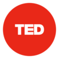
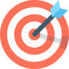
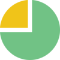
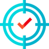
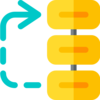
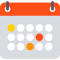
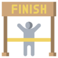

% Tips para mejorar la gestión de tu tiempo
% Adolfo Sanz De Diego (@asanzdiego)
% {style=box-shadow:none;}

# &nbsp;

## {style=box-shadow:none;}   Adolfo Sanz De Diego

> - Blog: [asanzdiego.com](http://asanzdiego.com/)
> - GitHub: [github.com/asanzdiego](http://github.com/asanzdiego)
> - Twitter: [twitter.com/asanzdiego](http://twitter.com/asanzdiego)
> - LinkedIn: [in/asanzdiego](http://www.linkedin.com/in/asanzdiego)
> - SlideShare: [slideshare.net/asanzdiego](http://www.slideshare.net/asanzdiego/)

## {style=box-shadow:none;}   Mi vida profesional

> - Asesor Técnico en la [CAM](http://www.comunidad.madrid/).
> - Profesor en la [Universidad de Alcalá](http://www.uah.es/).
> - Formador en [Pronoide](http://www.pronoide.com/).
> - Lider en [HackathonLovers](http://www.pronoide.com/).
> - Ponente en eventos y meetups.

## {style=box-shadow:none;}   Mi vida personal

> - Veo series, películas y charlas técnicas.
> - Aprendo algo nuevo todos los años.
> - Escribo  en mi blog.
> - Corro y voy al gimnasio.
> - Casado y padre de 2 hijas.

## {style=box-shadow:none;}   Esta charla

> - Mucha gente me pregunta de dónde saco tiempo.
>       - {style=box-shadow:none;vertical-align:middle} **motivación** de esta charla.
> - Primera charla no técnica que doy.
>       - {style=box-shadow:none;vertical-align:middle} **preparación** de esta charla.

## {style=box-shadow:none;}   Vídeos resumen

> - [Getting Things Done (GTD) | David Allen](https://www.youtube.com/watch?v=gCswMsONkwY)
>       - Captura, clarifica, organiza, revisa, comprométete.
> - [The 7 habits of highly effective people | Stephen Covey](https://www.youtube.com/watch?v=ktlTxC4QG8g)
>       - Los 2 más importantes: sé proactivo y haz primero lo primero.
> - [80/20 Rule - Do More by Doing Less | The Pareto Principle](https://www.youtube.com/watch?v=EAynHZE-lK4)
>       - El 80% de las consecuencias proviene del 20% de las causas.

## {style=box-shadow:none;}   Charlas TED

> - [How to gain control of your free time | Laura Vanderkam](https://www.youtube.com/watch?v=n3kNlFMXslo)
>       - "No tengo tiempo", a menudo significa "No es una prioridad."
> - [How to stop screwing yourself over | Mel Robbins](https://www.youtube.com/watch?v=Lp7E973zozc)
>       - La regla de los 5 segundos para no procrastinar.
> - [What makes a good life? Lessons from the longest study on happiness | Robert Waldinger](https://www.youtube.com/watch?v=8KkKuTCFvzI)
>       - Las relaciones cercanas y verdaderas hacen más feliz a la persona que el dinero o la fama.

## {style=box-shadow:none;}   Objetivos

> - Cumplir nuestros **sueños**.
> - **Desafiantes** (motivadores).
> - **Realizables** (nivel de habilidad).
> - **Medibles**.
> - **Depender de ti** exclusivamente.
> - **Todas las áreas** de tu vida.
> - Evalúalos y escríbelos **mínimo una vez al año**.

## {style=box-shadow:none;}   Áreas importantes

> - {style=box-shadow:none;vertical-align:middle;} **Salud**
>       - Alimentación, deporte, dormir, diversión...
> - {style=box-shadow:none;vertical-align:middle;} **Dinero**
>       - Trabajo, formación, gastos, ahorros...
> - {style=box-shadow:none;vertical-align:middle;} **Amor**
>       - Pareja, familia, amigos, comunidad...

## {style=box-shadow:none;}   Ejemplos de objetivos

> - Perder 2 kilos.
> - Correr una carrera de X km.
> - Dormir 8 horas.
> - Superar B2 de inglés.
> - Aprender una tecnología.
> - Ahorrar X € al año.
> - Pasar más tiempo con mi familia.

## {style=box-shadow:none;}   Tareas

> - Cumplir nuestros **objetivos**.
> - **Cortas**.
> - **Concretas**.
> - **Agendables**.
> - **Todos los objetivos** de tus sueños.
> - Priorízalos y agéndalos **mínimo una vez a la semana**.

## {style=box-shadow:none;}   Importante vs Urgente

+---------------+------------+---------------+
|               |  URGENTE   |  NO_URGENTE   |
+---------------+------------+---------------+
| IMPORTANTE    | - hazlo    | - agéndalo    |
+---------------+------------+---------------+
| NO_IMPORTANTE | - delégalo | - evítalo     |
+---------------+------------+---------------+

## {style=box-shadow:none;}   Ejemplos de tareas

> - L y X comer una ensalada.
> - M y J correr de 20:00 a 21:00.
> - Alarma a las 23:00 para irme a dormir.
> - Antes de acostarme 15 minutos deinglés.
> - En el metro ver charlas técnicas.
> - Meter X/12 € al mes en la cuenta de ahorro.
> - Domingos tarde juegos de mesa en familia.

## {style=box-shadow:none;}   Herramientas

> - **Calendario** con agenda.
> - **Lista de tareas**.
>       - Ejemplo: <http://bit.ly/lista-tareas>
> - **Otras listas** (lo que no escribes se olvida).
> - **Alarmas**.

## {style=box-shadow:none;}   Tips varios

> - Aprende a **decir NO**.
> - Una tarea **se expande** al tiempo asignado.
> - Si dura **menos de 2 minutos** hazlo.
> - Conoce tus **herramientas de trabajo**.
> - Mantén el **orden**.
> - **Automatiza** todo lo que puedas.
> - Recuerda la **regla 80/20**.
> - **Tiempos muertos** tareas de baja intensidad.

## {style=box-shadow:none;}   Distracciones

> - Haz **primero lo primero**.
> - Utiliza la **regla de los 5 segundos**.
> - Date de baja de **listas de correo**.
> - Desinstala las **redes sociales** del móvil.
> - Cierra las **pestañas del navegador**.

## {style=box-shadow:none;}   Interrupciones

> - **Modo no molestar** en móvil y ordenador.
> - **Correo** sólo 2/3 veces al día.
> - Haz sólo **una cosa a la vez**.
> - **Una llamada telefónica** ahorra muchos mails.
> - **Ponte cascos**.
> - **Reuniones** de no más de una hora con agenda clara.

## {style=box-shadow:none;}   Resumen

> - {style=box-shadow:none;vertical-align:middle} **Objetivos** desafiantes, realizables y medibles.
> - {style=box-shadow:none;vertical-align:middle} **Evalúalos** mínimo una vez al año.
> - {style=box-shadow:none;vertical-align:middle} **Tareas** cortas, concretas y que se puedan agendar.
> - {style=box-shadow:none;vertical-align:middle} **Agéndalas** mínimo una vez a la semana.
> - {style=box-shadow:none;vertical-align:middle} Evita las **distracciones** y las **interrupciones**.

## {style=box-shadow:none;}   Licencia

> - Obra con licencia [Creative Commons BY-SA](http://creativecommons.org/licenses/by-sa/3.0/es/)
> - Slides realizadas con [MarkdownSlides](https://github.com/asanzdiego/markdownslides)
> - Las imágenes son de [Freepik](https://www.freepik.com/home) descargadas de [FlatIcon](http://www.flaticon.com).

## {style=box-shadow:none;}   Gracias
